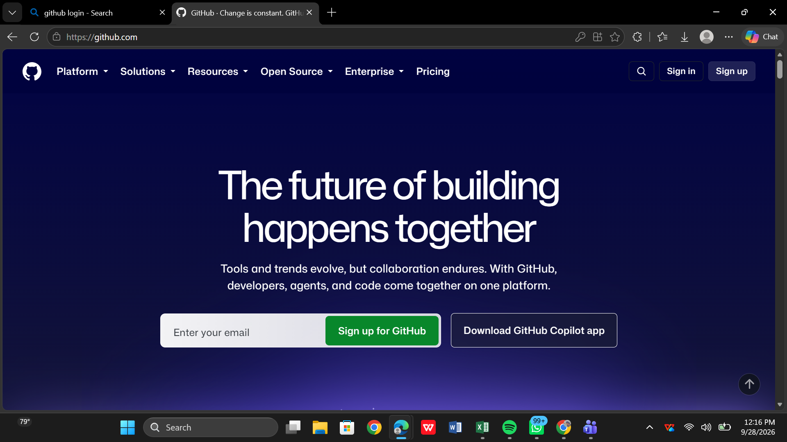
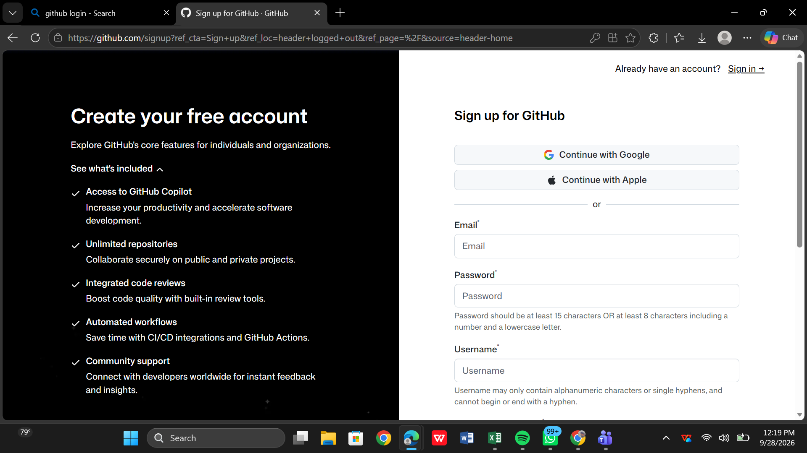

# Creating a GitHub Account
 
Now that you understand what GitHub is and how it differs from Git, it's time to actually get on the platform. Let's walk through it together, step by step, the same way you'd do it if you were sitting right next to me.
 
## Step 1: Visit the GitHub Website
 
Open your browser and go to **https://github.com**

 
The moment the page loads, you'll land on GitHub's homepage. It's a clean, dark-themed page with a bold headline welcoming you in — something along the lines of *"The future of building happens together."* Don't worry about the marketing language for now; what matters is what's sitting at the top right corner of that page.
 
Up there, you'll notice two buttons side by side:
 
- **Sign in** — for people who already have an account
- **Sign up** — for someone brand new, like you
Since this is your first time here, you'll want to click **Sign up**.
 
## Step 2: Create Your Free Account
 
Clicking Sign up takes you to a new page with a much bigger, friendlier headline: **"Create your free account."** This is where the real action begins.
 
On the left-hand side of this page, GitHub gives you a preview of what you're signing up for — a little reminder of what's included with a free account, such as:
 
- **Access to GitHub Copilot**, which helps speed up your coding with AI assistance
- **Unlimited repositories**, so you can work on as many public or private projects as you like
- **Integrated code reviews**, which help catch mistakes and improve code quality
- **Automated workflows**, powered by GitHub Actions, to save time on repetitive tasks
- **Community support**, connecting you with developers from all over the world
It's worth reading through this list once, just so you know what you're getting — but don't get distracted. Your actual attention should be on the right-hand side of the page, where the sign-up form lives.

 
## Step 3: Fill in Your Details
 
Here, GitHub gives you two paths to choose from:
 
**The fast way** — if you already have a Google or Apple account, you can simply click **Continue with Google** or **Continue with Apple**, and GitHub will use that account to set you up in seconds.
 
**The manual way** — if you'd rather create a fresh, standalone account, you'll fill in three fields:
 
- **Email** — the address GitHub will use to identify and verify you
- **Password** — and yes, GitHub is particular about this one. It needs to be at least 15 characters long, or at least 8 characters if it includes a number and a lowercase letter
- **Username** — this becomes your identity on GitHub, so choose it carefully. It can only contain letters, numbers, and single hyphens, and it can't begin or end with a hyphen
Take your time here. Your username especially is worth thinking about — it's often the first thing other developers, recruiters, or collaborators see when they visit your profile.
 
## Step 4: Verify and Finish Up
 
After filling in your details and clicking continue, GitHub will usually ask you to verify your email address, sometimes alongside a quick human-verification puzzle to confirm you're not a bot. Once that's done, your account is live, and you officially have a home on GitHub.
 
And just like that — you've gone from simply visiting a website to becoming part of a platform used by millions of developers around the world. The next step is learning what to actually do with this new account, starting with your very first repository.
 
